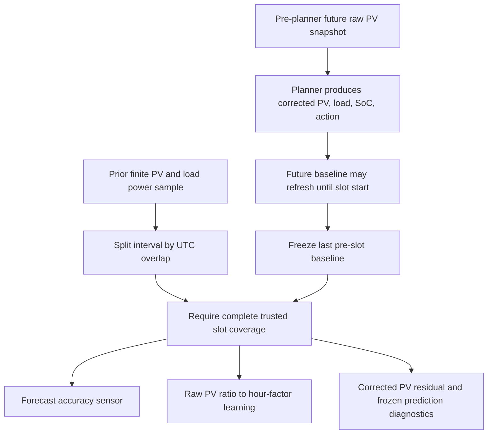

# Forecast Accuracy Tracking — Technical Guide

This document explains how HSEM captures trustworthy pre-slot PV, load, SoC,
and action forecasts, integrates actual energy, and reports forecast error.
Eligible closed-slot PV records also train the bounded
`SolarForecastCorrector`; the metrics themselves never write hardware or
select a battery action.

---

## Table of Contents

1. [Overview](#overview)
2. [Architecture](#architecture)
3. [ForecastTracker — core data structure](#forecasttracker--core-data-structure)
4. [Error metrics](#error-metrics)
5. [Coordinator integration](#coordinator-integration)
6. [Sensor attributes](#sensor-attributes)
7. [Reboot persistence](#reboot-persistence)
8. [Tests](#tests)

---

## Overview

HSEM relies on Solcast PV and historical house-load forecasts. The accuracy
pipeline:

1. Captures raw PV before live injection and corrected PV, load, predicted
   end-of-slot SoC, and action from the last successful plan seen **before**
   the slot starts.
2. Allows future replans to refresh that baseline, then freezes it at the
   physical slot boundary. A current or past replan cannot rewrite it.
3. Treats each valid power reading as applying to the preceding physical
   interval and splits that energy at UTC slot boundaries.
4. Rejects missing telemetry, stale gaps, and incomplete actual coverage
   instead of filling them with zero.
5. Computes MAE, bias, RMSE, and MAPE only from eligible closed slots.
6. Feeds raw-PV error to the learned hour factor, corrected-PV residual to the
   short-term corrector, and frozen SoC/action/load values to prediction
   diagnostics.
7. Persists recent tracker records through Home Assistant restore state.

The feature requires no new configuration and never writes the inverter. The
core tracker remains independent of Home Assistant and testable as pure Python.

---

## Architecture



### File layout

| File | Responsibility |
|---|---|
| `utils/forecast_tracker.py` | Pure-Python tracker, slot records, summary, serialization |
| `custom_sensors/forecast_accuracy_sensor.py` | HA diagnostic sensor (coordinator subscriber) |
| `coordinator.py` | Integrates accumulation & forecast registration into update cycle |
| `sensor.py` | Registers the sensor entity |
| `utils/sensornames.py` | Name/unique_id/entity_id helpers |

---

## ForecastTracker — core data structure

The `ForecastTracker` class in `utils/forecast_tracker.py` is a **rolling
ring-buffer** of `ForecastSlotRecord` objects.  It has **no** Home Assistant
dependencies and can be used in isolation.

### ForecastSlotRecord

Each record captures one planning slot:

| Field | Type | Description |
|---|---|---|
| `start` | `datetime` | Timezone-aware slot start |
| `end` | `datetime` | Timezone-aware slot end |
| `forecast_pv_kwh` | `float` | Corrected PV forecast frozen before slot start (kWh) |
| `raw_forecast_pv_kwh` | `float \| None` | Raw pre-correction PV baseline |
| `forecast_load_kwh` | `float` | Load forecast frozen before slot start (kWh) |
| `forecast_soc_pct` | `float \| None` | Frozen predicted end-of-slot SoC |
| `forecast_action` | `str \| None` | Frozen planner action label |
| `forecast_frozen` | `bool` | Whether the last pre-slot baseline is immutable |
| `actual_coverage_seconds` | `float \| None` | Trusted physical coverage; `None` is legacy compatibility |
| `actual_pv_kwh` | `float` | Accumulated actual PV energy (kWh) |
| `actual_load_kwh` | `float` | Accumulated actual load energy (kWh) |
| `finalised` | `bool` | `True` after slot's end time passed and metrics computed |
| `mae_pv` / `mae_load` | `float \| None` | Absolute slot errors, set on finalise |
| `bias_pv` / `bias_load` | `float \| None` | Signed slot errors, set on finalise |

A record is accuracy-eligible only when it has a frozen raw baseline and
complete trusted actual coverage. Prediction diagnostics additionally require
frozen SoC and action values. Legacy direct callers may use
`actual_coverage_seconds=None`, but restored pre-v7.1.2 records lack the new
raw/frozen fields and therefore remain ineligible.

Key methods:

- **`accumulate_pv(energy_kwh)`** / **`accumulate_load(energy_kwh)`** —
  Add measured energy to the accumulator.  Called multiple times per slot
  as the coordinator cycles.
- **`finalise()`** — Freezes the record and computes `mae_pv`, `mae_load`,
  `bias_pv`, `bias_load`.  Idempotent — calling a second time is a no-op.
- **`to_dict()`** / **`from_dict(data)`** — JSON-safe serialization for
  reboot persistence (see below).

### ForecastTracker

| Property / Method | Description |
|---|---|
| `records` | Copy of all slot records, oldest first |
| `summary` | Aggregates finalised, accuracy-eligible records |
| `get_or_create_record(start, end)` | Returns existing record or creates a new one |
| `find_record(start)` | Look up a record by slot start time |
| `finalise_record(start)` | Finalise a specific record |
| `finalise_past_records(now)` | Finalise all records whose `end <= now` |
| `set_forecasts(..., observed_at=...)` | Refresh a future baseline; rejects started/frozen slots |
| `freeze_forecasts(now)` | Freeze every baseline whose physical start has arrived |
| `accumulate_power_interval(start, end, ...)` | Split prior-sample energy across frozen records by UTC overlap |
| `to_dict()` / `load_from_dict(data)` | Serialize / deserialize the full record list |

The integration configures a maximum of 2880 records, covering approximately
30 days of 15-minute slots; the standalone class default remains 96 records.
Older records are automatically pruned.

### Energy accumulation

$$
E = P \times \frac{\Delta t}{3600} \times \frac{1}{1000}
$$

where $P$ is instantaneous power in watts and $\Delta t$ is elapsed seconds.

The **previous** finite power sample represents `[previous_timestamp, now)`.
HSEM splits that half-open interval by UTC overlap, so a poll at 10:15:05
allocates the pre-boundary share to the 10:00 slot and the remainder to 10:15.
Both PV and load telemetry must be finite at both endpoints. A gap longer than
twice the effective coordinator cadence is rejected, and sample state still
advances so recovery cannot backfill stale power. Only a fully covered physical
slot is eligible; this also keeps both folds of an autumn repeated hour
independent.

---

## Error metrics

Once a slot is finalised, the `ForecastErrorSummary` dataclass aggregates
across all finalised records:

### MAE — Mean Absolute Error

$$
\mathrm{MAE} = \frac{1}{n} \sum_{i=1}^{n} \left| \mathrm{forecast}_i - \mathrm{actual}_i \right|
$$

Units: kWh.  Averages the absolute deviation.  Lower is better.

### Bias (signed error)

$$
\mathrm{Bias} = \frac{1}{n} \sum_{i=1}^{n} \left( \mathrm{forecast}_i - \mathrm{actual}_i \right)
$$

Units: kWh.  Positive bias = systematic over-forecast (predicted more than
actually occurred).  Negative bias = under-forecast.  Zero bias means the
forecast is accurate on average (but may have large cancellations).

### RMSE — Root Mean Squared Error

$$
\mathrm{RMSE} = \sqrt{ \frac{1}{n} \sum_{i=1}^{n} \left( \mathrm{forecast}_i - \mathrm{actual}_i \right)^2 }
$$

Units: kWh.  Penalises large errors more heavily than MAE.  Useful for
detecting occasional big misses.

### MAPE — Mean Absolute Percentage Error

$$
\mathrm{MAPE} = \frac{1}{n} \sum_{i=1}^{n} \frac{ \left| \mathrm{forecast}_i - \mathrm{actual}_i \right| }{ \left| \mathrm{actual}_i \right| } \times 100
$$

Units: percent.  Makes errors comparable across different power levels.
Returns ``None`` when all actual values are zero (division by zero guard).

### Exposure via `as_dict()`

The summary also includes:
- `window_slots` — total slots in the ring buffer (finalised + unfinalised)
- `finalised_slots` — how many slots contribute to the metrics

---

## Coordinator integration

The coordinator owns one `ForecastTracker` with a rolling capacity sized for
long-term diagnostics. Two phases run around the planner:

### `_accumulate_forecast_actuals(now, live)`

Before planning, the coordinator snapshots raw, available PV values only for
future recommendation slots. It sets the solar corrector's physical reference
time, freezes slots that have started, integrates the prior valid live-power
interval with a stale-gap ceiling, and finalises ended records.

Only accuracy-eligible records teach `SolarForecastCorrector`: the raw PV
baseline trains the hour factor while the corrected baseline trains the
short-term residual. Only prediction-eligible records enter the SoC/action
tracker, using their own frozen values rather than the newest planner output.

Prediction accuracy is emitted only on the coordinator cycle where a slot first
transitions to finalised, and only with a finite actual SoC. Restored or already
finalised slots never replay it; warm-up counts unique physical UTC slot keys.

### `_register_forecasts_from_planner(output, now)`

After a successful plan, only still-future slots with an available pre-planner
raw baseline are registered. Corrected PV, load, predicted end SoC, and action
may refresh until the slot starts. Registration at or after physical slot start
is rejected, preventing live-injected current-slot data or a later replan from
changing the comparison.

---

## Sensor attributes

The `HSEMForecastAccuracySensor` is a diagnostic sensor
(`EntityCategory.DIAGNOSTIC`) that subscribes to the coordinator.

### State

The sensor's `native_value` is the **PV MAE** in kWh, rounded to 3 decimal
places. It returns `None` while no eligible slots have been finalised.

### Extra state attributes

| Attribute | Source | Example |
|---|---|---|
| `window_slots` | `ForecastErrorSummary.window_slots` | `192` |
| `finalised_slots` | `ForecastErrorSummary.finalised_count` | `24` |
| `mae_pv_kwh` | `ForecastErrorSummary.mae_pv_kwh` | `0.1523` |
| `mae_load_kwh` | `ForecastErrorSummary.mae_load_kwh` | `0.0841` |
| `bias_pv_kwh` | `ForecastErrorSummary.bias_pv_kwh` | `0.0421` |
| `bias_load_kwh` | `ForecastErrorSummary.bias_load_kwh` | `-0.0112` |
| `rmse_pv_kwh` | `ForecastErrorSummary.rmse_pv_kwh` | `0.2134` |
| `rmse_load_kwh` | `ForecastErrorSummary.rmse_load_kwh` | `0.1245` |
| `mape_pv_pct` | `ForecastErrorSummary.mape_pv_pct` | `22.5` |
| `mape_load_pct` | `ForecastErrorSummary.mape_load_pct` | `8.3` |
| `latest_pv_forecast_kwh` | Latest finalised record's forecast PV | `1.25` |
| `latest_pv_actual_kwh` | Latest finalised record's actual PV | `1.18` |
| `latest_load_forecast_kwh` | Latest finalised record's forecast load | `0.65` |
| `latest_load_actual_kwh` | Latest finalised record's actual load | `0.72` |
| `latest_bias_pv_kwh` | Latest finalised record's PV bias | `0.07` |
| `latest_bias_load_kwh` | Latest finalised record's load bias | `-0.07` |
| `_forecast_tracker_data` | Serialised record list (used internally) | *(opaque dict)* |

All summary and `latest_*` values filter on accuracy eligibility. A finalised
but incomplete or legacy record is never displayed as if it were a zero-actual
forecast miss.

### Template examples

```yaml
# Get PV MAE
{{ state('sensor.hsem_forecast_accuracy_sensor') }}

# Get PV bias
{{ state_attr('sensor.hsem_forecast_accuracy_sensor', 'bias_pv_kwh') }}

# Check if PV systematically over-forecasts
{{ state_attr('sensor.hsem_forecast_accuracy_sensor', 'bias_pv_kwh') > 0.1 }}

# Get load MAPE as percentage
{{ state_attr('sensor.hsem_forecast_accuracy_sensor', 'mape_load_pct') }}
```

---

## Reboot persistence

The forecast tracker data survives HA restarts using the standard
`RestoreEntity` pattern already used by other HSEM diagnostic sensors:

1. **Every live cycle**, the sensor attributes include
   `_forecast_tracker_data` with a bounded lifecycle selection: the
   active/frozen baseline, newest eligible finalised history, then the nearest
   eligible future baselines. Distant unfrozen horizon records are omitted so
   they cannot displace useful restart history from Home Assistant's
   state-attribute limit.

2. **HA's recorder** automatically stores these attributes in its database.

3. **On restart**, `async_added_to_hass` calls `async_get_last_state()`
   to retrieve the previous state, extracts `_forecast_tracker_data`, and
   passes it to `tracker.load_from_dict(data)`.

4. Current-schema eligible records continue contributing. Records from the
   older live-rewritten schema still deserialize, but missing raw/frozen fields
   make them permanently ineligible for metrics and learning.

The first post-restart power sample establishes a new boundary; HSEM does not
invent energy for the restart gap. No restored forecast record is paired with a
post-restart live SoC sample for prediction accuracy.

On the v7.1.2 upgrade, pre-v3 `SolarForecastCorrector` factors, history, and
residuals are deliberately cold-reset because they were learned from
contaminated baselines. The user's internal confidence value is retained.
Valid v3 state restores the exact bounded per-hour and residual buffers plus
its UTC replay watermark atomically. Malformed, non-finite, or future-dated
watermark state cold-resets instead. The prediction-accuracy sensor may show
its restored scalar during startup only; the first live coordinator snapshot
returns a fresh metric or `None`.

---

## Tests

Tests cover the pure tracker, coordinator timing, solar-corrector integration,
and restore sensors. Regression scenarios include boundary-crossing samples,
missing telemetry, stale gaps, incomplete coverage, post-start replans,
spring-forward and autumn-fold identities, legacy-state exclusion, and cold
reset behavior.

```bash
./scripts/quality.sh test tests/test_forecast_tracker.py tests/test_solar_corrector.py
```
