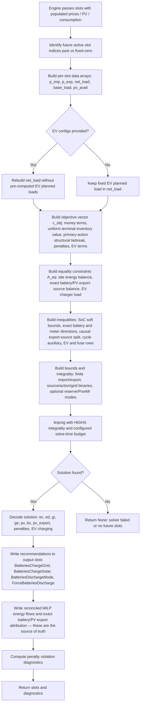
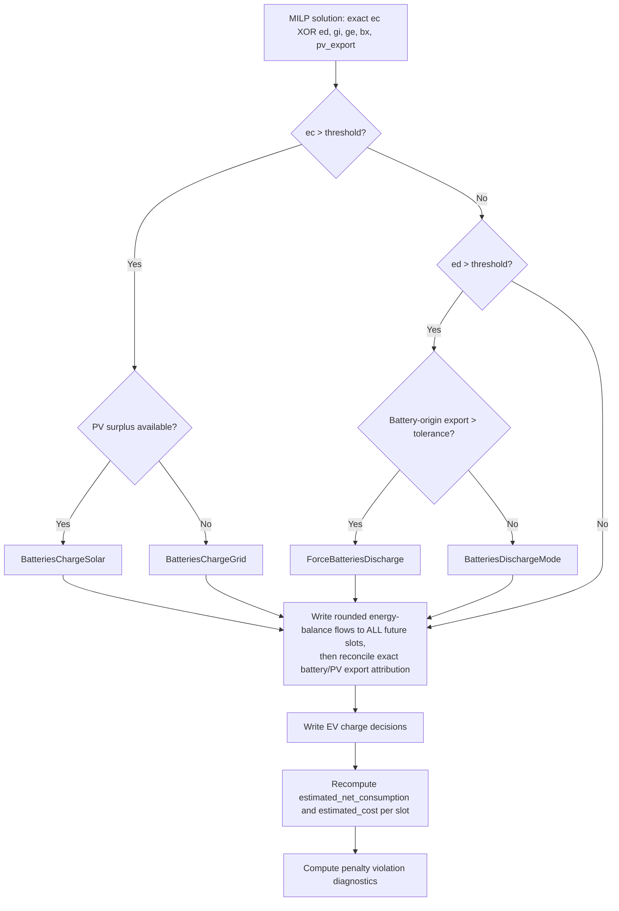

# HSEM MILP Optimization

The MILP solver (`planner/milp_optimizer.py`) finds the globally optimal battery charge/discharge schedule using scipy's HiGHS linear programming solver. It is the **only active optimiser**. The planner also scores a diagnostic no-action comparator and keeps one passive, non-arbitrage fallback for solver failure.

---

## Pipeline



---

## Variable layout

### Core primary variables (9 × n slots)

For each slot `t ∈ 0…n-1`, the layout first allocates nine core blocks:

| Offset | Variable | Name | Description | Bounds |
|---|---|---|---|---|
| `0` | `ec[t]` | `ec_off` | Energy charged and stored in battery this slot (kWh) | `[0, max_charge_per_slot]` |
| `n` | `ed[t]` | `ed_off` | Energy discharged from battery this slot (kWh) | `[0, max_discharge_per_slot]` |
| `2n` | `gi[t]` | `gi_off` | Grid import this slot (kWh) | `[0, ∞)` |
| `3n` | `ge[t]` | `ge_off` | Grid export this slot (kWh) | `[0, ∞)` — hard-capped to `max_grid_export_power_kw × slot_hours` when the export cap is configured (issue #726) |
| `4n` | `pv[t]` | `pv_off` | PV surplus available in slot t (kWh) | `[pv_avail[t], pv_avail[t]]` (fixed) |
| `5n` | `m[t]` | `m_off` | Auxiliary variable ≥ max(ec[t], ed[t]) for cycle cost (kWh) | `[0, ∞)` |
| `6n` | `s_max_pen[t]` | `s_max_off` | SoC upper penalty — kWh by which state of charge exceeds `usable_kwh` | `[0, ∞)` |
| `7n` | `s_min_pen[t]` | `s_min_off` | SoC lower penalty — kWh by which state of charge drops below 0 | `[0, ∞)` |
| `8n` | `curt[t]` | `curt_off` | Explicit PV curtailment (kWh) | `[0, ∞)`; site balance limits useful curtailment |

The state of charge `soc[t]` is **not an explicit variable** — it is derived from the forward recurrence:

$$
soc[t] = soc[0] + \sum_{k=0}^{t} \bigl( ec[k] - ed[k] \bigr)
$$

Penalty variables `s_max_pen` and `s_min_pen` prevent infeasibility when the initial SoC lies outside `[0, usable_kwh]`. Their objective coefficient is extremely high (`max(p_imp) × 100`), so they are only used when the initial state is physically out of bounds.

`MilpColumnLayout` is the single source of truth for all allocation. Every
EV, fuse, export-source, export-mode, and secondary-storage block is appended
through that layout and receives its offset by name; consumers must not repeat
a hand-calculated base offset. Immediately before solving, the declared
`column_count` must equal the objective length, both constraint-matrix widths,
and the bounds length. Incumbent validation uses the same declared blocks.
Adding or reordering a base block must therefore either shift every downstream
consumer coherently or fail before HiGHS is called.

Solver diagnostics expose the declaration as `model_variable_blocks`; each
entry carries `offset`, `width`, and `per_slot`. The contiguous cursor and
the keys `model_column_count`, `model_objective_column_count`,
`model_equality_column_count`, `model_inequality_column_count`, and
`model_bounds_count` must all resolve to the same final width.
`model_integral_blocks` lists each wholly integral named block and
`model_integrality_count` reports the integral-column total. The three
always-present source/action/grid blocks must appear in that list.
`grid_import_export_overlap_max_kwh` is computed from the raw solution as
`max_t(min(gi[t],ge[t]))` and must be zero within solver tolerance.

### EV co-optimization extension

When one or more active EVs are provided, the variable vector expands to:

$$
\text{total variables after EVs} = B_{core} + n \cdot E + E, \qquad B_{core}=9n
$$

where `E` is the number of active EVs.

| Offset | Variable | Name | Description | Bounds |
|---|---|---|---|---|
| after base + `i·n` | `evN_c[t]` | EV N DC-side charge per slot (kWh) | `[0, evN.max_charge_per_slot]` |
| after all EV charge blocks + `i` | `evN_pen` | EV N deadline target slack (kWh shortfall) | `[0, ∞)` |

The EV charger AC load entering the energy balance equation is `evN_c[t] / charger_efficiency`.

When an EV's `charge_past_target` flag is `True` (EV already at user-configured target SoC, `allow_charge_past_target_soc` enabled, SoC < 100 %):
- The deadline constraint is **suppressed** (`deadline_slot = None`) — no grid import pressure
- The **surplus-only constraint** is added (see Constraints below)
- An **avoided-future-import-cost benefit** (`future_value_per_kwh`, issue #630) is added to the objective, falling back to a tiny fixed tiebreaker when no future price data is available (see Objective function below)

When an EV has a deadline and `charge_past_target=False` (normal mode):
- **Pre-deadline slots** (`t \u2264 D`): direct benefit `-ev_penalty_cost` on `ev_c[t]` forces charging.  This benefit is **mutually exclusive** with `charge_past_target` — the LP guards the pre-deadline benefit block with `and not ev.charge_past_target`, mirroring the post-deadline zero-charge and target-cap constraint guards.
- **Post-deadline slots** (`t > D`): hard constraint `ev_c[t] = 0` — charging is forbidden

### Fuse constraint extension (issue #567)

When `main_fuse_amps > 0`, the variable vector expands further:

$$
\text{total variables after fuse} = B_{core} + n \cdot E + E + n
$$

| Offset | Variable | Name | Description | Bounds |
|---|---|---|---|---|
| after EV vars | `gi_pen[t]` | `gi_pen_off` | Grid import fuse penalty — kWh exceeding the main fuse rating | `[0, ∞)` |

The max grid import per slot is converted from amps to kWh/slot:

$$
\mathrm{max\_grid\_import} = \frac{\mathrm{amps} \times 230 \times \mathrm{phases}}{1000} \times \frac{\mathrm{interval\_minutes}}{60}
$$

where ``phases`` is the electrical phase count (1 or 3, default 3).
This assumes balanced load at 230 V phase-to-neutral per phase.

The penalty uses the same high coefficient as SoC penalties (`max(p_imp) × 100`), ensuring the solver only exceeds the fuse limit when physically unavoidable (e.g. house base load alone exceeds the rating). When `main_fuse_amps` is `None` or 0, no variables or constraints are added — behaviour is unchanged.

When optional phase-aware charging is enabled on a three-phase installation,
three additional hard inequality rows are added per slot without adding
variables. With total signed site flow $G_t=gi_t-ge_t$, fixed live imbalance
$\Delta_{i,t}$, PowMr site delta $D_t$, and configured PowMr phase $p$:

$$
F_{i,t}=G_t/3+\Delta_{i,t}+(\mathbf{1}_{i=p}-1/3)D_t
$$

Each $F_{i,t}$ is capped at the 230 V per-phase fuse target. If uncontrollable
base load already exceeds that target, the row permits exactly that baseline so
the model remains feasible while forbidding controllable charge from worsening
it. Huawei charge is balanced by construction; PowMr charge and Utility/SBU
load switching affect only its configured phase.

### Primary export-source, action-mode, and grid-flow extension

After the core, active-EV, and optional-fuse blocks, the layout always appends
five named per-slot blocks. Let `B` be the layout's current
`column_count` at that point:

| Allocated offset | Variable | Name | Description | Bounds |
|---|---|---|---|---|
| `B` | `bx[t]` | `primary_battery_export` | Battery-side DC discharge attributed to grid export (kWh) | `[0, max_discharge_per_slot]` |
| next named block | `pv_export[t]` | `pv_export` | Non-primary-battery AC grid export, normally direct PV (kWh) | `[0, pv_avail[t] + PowMr_SBU_revealed_PV[t]]` |
| next named block | `z_source[t]` | `export_source_mode` | Selects the exact causal branch for `bx=min(ed,ge/η_dis)` | binary |
| next named block | `y_action[t]` | `primary_action_mode` | Selects primary charge or discharge eligibility | binary |
| next named block | `y_grid[t]` | `grid_flow_mode` | Selects physical meter import or export direction | binary |

If the conditional export reserve is enabled, its binary
`battery_export_mode` block is appended next. Secondary storage follows all
primary blocks. No consumer derives any of these offsets from `9n`, EV count,
fuse state, or optional-block assumptions; it asks `MilpColumnLayout` for the
named block.

### Secondary stationary-storage extension (PowMr fork, issue #1)

When a valid `SecondaryStorageConfig` is present, six `n`-slot blocks are
appended after all previously declared core, EV, fuse, export-source, and
optional export-mode variables. Let `B` be that prior vector length:

| Offset | Variable | Description | Type / bounds |
|---|---|---|---|
| `B` | `secondary_charge[t]` | Stored PowMr charge energy (kWh) | continuous, bounded by configured current |
| `B+n` | `secondary_discharge[t]` | PowMr battery energy removed (kWh) | continuous, dedicated-load equality |
| `B+2n` | `secondary_throughput[t]` | max(charge, discharge) wear auxiliary | continuous, non-negative |
| `B+3n` | `secondary_charge_mode[t]` | Utility-charge mode | binary |
| `B+4n` | `secondary_sbu_mode[t]` | Battery supplies dedicated load | binary |
| `B+5n` | `secondary_charge_steps[t]` | Count of physical current increments | integer |

The current-step equality is:

$$
secondary\_charge[t]
= \frac{V \times \Delta I \times slot\_hours}{1000}
\times secondary\_charge\_steps[t]
$$

For the PowMr reference hardware, $\Delta I=10$ A. Charge and SBU mode are
mutually exclusive. The secondary state recurrence uses hard 20–100 % bounds,
and SBU discharge is fixed to dedicated AC load divided by discharge efficiency
plus configured inverter overhead. Because discharge is tied to that isolated
load, it cannot backfeed or export.

When house history is configured to include the dedicated load, the site-bus
credit is conservatively capped at `min(dedicated_load, gross_house_load)`.
Battery draw still serves the full live dedicated load, but incomplete mixed
Utility/SBU history can never turn that draw into modeled PowMr backfeed.

The secondary AC branch is included in `gi[t]`, so the existing aggregate
main-fuse row covers its bypass load and charging. The optional phase rows move
that branch delta from the balanced share onto its configured physical phase.
Unless explicitly allowed, an extra constraint enforces zero Huawei discharge
whenever secondary charge mode is on. This prevents battery-to-battery transfer
through two conversion stages.

---

## Objective function

$$
\begin{aligned}
\mathrm{minimise} \quad
\sum_{t} \delta_t \cdot \bigg[
    & p_{\mathrm{imp}}[t] \cdot gi[t]
    && \text{grid import cost} \\
    - & p_{\mathrm{exp}}[t] \cdot ge[t]
    && \text{export revenue} \\
    + & \alpha \cdot m[t]
    && \text{battery cycle cost (depreciation)} \\
    + & \epsilon_{\mathrm{chg}} \cdot p_{\mathrm{imp}}[t] \cdot ec[t]
    && \text{charge-side conversion loss cost} \\
    + & \epsilon_{\mathrm{dis}} \cdot \bigl(
          p_{\mathrm{imp}}[t](ed[t]-bx[t]) +
          p^+_{\mathrm{exp}}[t]bx[t]\bigr)
    && \text{destination-aware discharge loss cost} \\
    + & p_{\mathrm{soc}} \cdot \bigl( \mathrm{s\_max\_pen}[t] + \mathrm{s\_min\_pen}[t] \bigr)
    && \text{SoC soft-constraint penalties} \\
    + & p_{\mathrm{fuse}} \cdot \mathrm{gi\_pen}[t]
    && \text{Main fuse grid-import penalty}
\bigg] \\
+ & R \cdot \sum_t \bigl(ed[t]-ec[t]\bigr)
    && \text{terminal inventory value (uniform, undiscounted)} \\
+ & \epsilon_a \sum_t\bigl(ec[t]+ed[t]\bigr)
  - 1.5\epsilon_a\sum_t\bigl(ed[t]-bx[t]\bigr)
    && \text{primary-action structural tiebreak (undiscounted)} \\
\end{aligned}
$$

Plus EV deadline penalties (undiscounted — deadline is a hard commitment):

$$
\sum_{v=1}^{E} p_{\mathrm{ev\_pen}}^{(v)} \cdot \mathrm{ev\_pen}_v
$$

Where:

| Symbol | Description |
|---|---|
| $\delta_t$ | Time discount per slot: $\delta_t = r^{\Delta t}$ where $\Delta t$ is hours from now |
| $p_{\mathrm{imp}}[t]$ | Grid import price (currency/kWh), sanitised to `max(p_imp_raw[t], 0)` (issue #655). |
| $p_{\mathrm{exp}}[t]$ | Grid export price (currency/kWh). Before solving, `p_exp` is sanitised: (1) clamped to 0 when below `min_export_price` (physically blocked export), and (2) clamped to `min(p_exp, p_imp)` to prevent an unbounded LP when `p_exp > p_imp` in any slot (issue #635). |
| $p^+_{\mathrm{exp}}[t]$ | Non-negative sanitised export price used to value conversion loss on battery-origin export. |
| $\alpha$ | Battery cycle cost per kWh: $\alpha = \frac{P \cdot L_{pct}/100}{2 \cdot N \cdot C_u}$ |
| $\epsilon_{\mathrm{chg}}$ | Charge-side loss fraction: $\epsilon_{\mathrm{chg}} = 1 - \eta_{\mathrm{chg}}$ |
| $\epsilon_{\mathrm{dis}}$ | Discharge-side loss fraction: $\epsilon_{\mathrm{dis}} = 1 - \eta_{\mathrm{dis}}$ |
| $R$ | Non-negative terminal-inventory replacement price (currency/kWh), from the engine; missing/non-finite resolves to zero |
| $\epsilon_a$ | Primary-action structural weight, exactly $0.00001$ currency per battery-side DC kWh |
| $p_{\mathrm{soc}}$ | SoC penalty cost: $\max(p_{\mathrm{imp}}) \times 100$ |
| $p_{\mathrm{fuse}}$ | Fuse penalty cost: $\max(p_{\mathrm{imp}}) \times 100$ (same magnitude as SoC) |
| $p_{\mathrm{ev\_pen}}^{(v)}$ | EV deadline penalty for EV v: $\max(p_{\mathrm{imp}}) \cdot \max(\mathrm{energy\_needed}, 1.0) \cdot 10$ |
| $\beta_{\mathrm{ev}}^{(v)}$ | EV charge-past-target benefit for EV v: `future_value_per_kwh` — avoided-future-import valuation (issue #630), or a $0.0001$ per kWh AC fallback tiebreaker when no future price data is available |

The terminal term is a final-inventory valuation, not a collection of per-slot
premiums. Because the same $R$ multiplies every battery-side discharge and
charge, equal discharge and recharge cancel exactly. Slot prices, efficiencies,
cycle wear, capacity, headroom, and power constraints then decide whether a
refill cycle is worthwhile. This retains the issue #694 same-slot PV/export and
issue #592 deferred-cheap-surplus behaviours without a path-dependent charge
credit cap.

The structural tiebreak uses the exact export-source split, so $ed[t]-bx[t]$
is local battery discharge. Its per-DC-kWh perturbation is
$+\epsilon_a$ for charge, $-0.5\epsilon_a$ for local discharge, and
$+\epsilon_a$ for battery-origin export. Charge/local-discharge and
export/refill cycles therefore add $0.5\epsilon_a$ and $2\epsilon_a$
respectively. On a true lossless/economic tie, local discharge wins,
preserving the intent of issues #638/#655. A 97%-efficient discharge at a
flat tariff is not an economic tie and is deliberately no longer forced.

This is a weighted structural tiebreak, not a mathematically lexicographic
objective. It can alter economics below $\epsilon_a$, and the configured 0.5%
MIP gap does not guarantee proof of an $\epsilon_a$-sized distinction. At
ordinary 48-hour/10 kW primary-battery bounds its total perturbation remains
below about 0.01 currency. It is part of selector `score` under
`PlanCostBreakdown.primary_action_tiebreak`, but not auditable
`total_cost`.

The engine derives $R$ from the first contiguous published,
price-actionable heuristic discharge block, using the mean of its `top_n`
dearest import prices. With opt-in forecast valuation, the unpublished
forecast tail is reduced by MAE plus the configured margin and the effective
value is `max(published_value, forecast_haircut_value)`. This heuristic is
horizon-end inventory context: it neither models future grid/PV refill nor
acts as a per-slot export floor. Forecast points do not enter slot prices,
actionability, bounds, export revenue, or any physical flow constraint.

Plus EV pre-deadline benefit (undiscounted, per EV $v$ with deadline, slots $t \leq D_v$):

$$
-\sum_{v=1}^{E} \sum_{t=0}^{D_v} p_{\mathrm{ev\_pen}}^{(v)} \cdot \mathrm{ev\_c}_v[t]
$$

This direct benefit on pre-deadline slots ensures the LP always prefers charging over paying the deadline penalty. Post-deadline slots ($t > D_v$) have zero coefficient unless `charge_past_target=True`.

The pre-deadline benefit block and the charge-past-target benefit block are **mutually exclusive** by design. The LP construction guards the pre-deadline block with `and not ev.charge_past_target`, mirroring the post-deadline zero-charge constraint's guard. An EV in charge-past-target mode never receives the large penalty-driven benefit — only the `future_value_per_kwh` benefit (or its tiebreaker fallback) applies. This exclusion is enforced directly in the LP construction rather than relying on caller discipline in `engine_core.py`.

Plus EV charge-past-target benefit (discounted, per charge-past-target EV $v$):

$$
-\sum_{v \in \mathrm{past\_target}} \sum_{t} \delta_t \cdot \frac{\beta_{\mathrm{ev}}^{(v)}}{\eta_{\mathrm{charger}}^{(v)}} \cdot \mathrm{ev\_c}_v[t]
$$

$\beta_{\mathrm{ev}}^{(v)}$ is `EVConfig.future_value_per_kwh`: the avoided cost of importing the same energy later, computed as `confidence_factor × mean(import_price)` over the next 24 hours (`ev_future_charge_value_per_kwh` in `candidate_selector.py`, mirroring `replacement_price_from_next_discharge` for the house battery's terminal SoC). `confidence_factor` defaults to `0.9` and is configurable per EV (`hsem_ev_past_target_confidence_factor` / `hsem_ev_second_past_target_confidence_factor`) to discount for uncertainty in whether the EV will actually need the extra energy before its next charge.

Because $\beta_{\mathrm{ev}}^{(v)}$ is priced in the same currency units as $p_{\mathrm{imp}}$ and $p_{\mathrm{exp}}$, charge-past-target EV charging competes fairly against both house battery charging and grid export — whichever has the higher genuine avoided-cost value wins the surplus for that slot. When no future price data is available (`future_value_per_kwh` is `None`), the MILP falls back to a tiny fixed tiebreaker ($0.0001$ per kWh AC) so surplus PV still prefers the EV over being wastefully curtailed/exported at near-zero or negative prices.

---

## Constraints

### Equality constraint — energy balance per slot

For each slot $t$:

$$
gi[t] + pv[t] + ed[t] \cdot \eta_{\mathrm{dis}} =
\operatorname{base\_load}[t] + \frac{ec[t]}{\eta_{\mathrm{chg}}} + ge[t] + \sum_{v=1}^{E} \frac{\operatorname{ev\_c}_v[t]}{\eta_{\mathrm{charger}}^{(v)}}
$$

- `base_load[t]` = $\max(\operatorname{net\_load}[t], 0)$ — demand the grid/battery must satisfy (kWh)
- `net_load[t]` = `avg_house_consumption[t] - solcast_pv_estimate[t]` (when EV co-optimisation active)
- `pv_avail[t]` = $\max(-\operatorname{net\_load}[t], 0)$ — PV surplus fixed to the `pv[t]` variable bounds
- EV charger efficiency re-scales DC-side charge to AC grid/PV load

Export origin is enforced by a second equality:

$$
ge[t] - \eta_{\mathrm{dis}}\,bx[t] - pv\_export[t] = 0
$$

with $0 \leq bx[t] \leq ed[t]$ and

$$
\eta_{\mathrm{dis}}(ed[t]-bx[t])
\leq eligible\_local\_ac\_sinks[t].
$$

`eligible_local_ac_sinks` is the complete set of fixed loads the model permits
the Huawei battery to serve: residual non-EV house demand and, where
configured, eligible PowMr dedicated-load or primary-transfer demand, with a
PowMr SBU site-load offset removed. Active co-optimised EV demand is
deliberately excluded, as is pre-accounted fixed EV demand through its site
cap. PV therefore serves flexible EV load before the battery can be credited
with local discharge. Thus `bx[t]` is the battery-side discharge whose AC
output reaches the grid, while `ed[t]-bx[t]` serves only allowed fixed sinks.
`pv_export[t]` is a non-negative AC source block, not a post-hoc guess. The
exact source-conservation invariant is:

$$
\eta_{\mathrm{dis}}\,bx[t] + pv\_export[t] = ge[t]
$$

The split is causal and independent of objective coefficients:

$$
bx[t] = \min\left(ed[t],\frac{ge[t]}{\eta_{\mathrm{dis}}}\right)
$$

Let $z_{source}[t]$ be the binary `export_source_mode`,
$M_d[t]$ the finite discharge upper bound, and $M_{pv}[t]$ the finite
non-battery export upper bound. The branch rows are:

$$
ed[t]-bx[t] \leq M_d[t](1-z_{source}[t])
$$

$$
ge[t]-\eta_{\mathrm{dis}}bx[t] \leq M_{pv}[t]z_{source}[t]
$$

Together with source conservation and `bx<=ed`, `z_source=0` makes all
aggregate export battery-origin until that export is exhausted, while
`z_source=1` makes all concurrent battery discharge export-origin before a
non-battery remainder is permitted. Consequently battery-caused export cannot
be relabelled as PV export in a slot that also has PV and forced EV load.

The physical non-battery upper bound is:

$$
0 \leq pv\_export[t]
\leq pv\_avail[t] + PowMr\_SBU\_revealed\_PV[t].
$$

The PowMr term is non-zero only when switching a dedicated load already
included in the site measurement to SBU can reveal PV that was hidden behind
that load.

Grid import and export are opposite directions through one meter. With finite
physical bounds $M_i[t]$ and $M_e[t]$, binary `grid_flow_mode[t]` enforces:

$$
gi[t] \leq M_i[t]y_{grid}[t]
$$

$$
ge[t] \leq M_e[t](1-y_{grid}[t])
$$

$M_i[t]$ covers reachable fixed site load, maximum primary/EV charge, and
configured PowMr load/charge. $M_e[t]$ covers the finite non-battery export
bound plus maximum delivered primary discharge. Both flows may be zero, but
they cannot both be positive. This prevents a zero-net import/export wash from
manufacturing source attribution that disappears during result reconciliation.

### Inequality constraints

**SoC upper bound (soft):**

$$
\sum_{k=0}^{t} \bigl( ec[k] - ed[k] \bigr) - \mathrm{s\_max\_pen}[t] \leq C_u - soc_0
$$

**SoC lower bound (soft):**

$$
-\sum_{k=0}^{t} \bigl( ec[k] - ed[k] \bigr) - \mathrm{s\_min\_pen}[t] \leq soc_0
$$

**Exact primary action choice — no simultaneous charge + discharge:**

$$
ec[t] \leq \mathrm{max\_charge}[t] \cdot y_{action}[t]
$$

$$
ed[t] \leq \mathrm{max\_discharge}[t] \cdot (1-y_{action}[t])
$$

where binary $y_{action}[t]$ is the named `primary_action_mode` block. Both
flows may be zero, but they cannot both be positive.

**Cycle cost auxiliary — forcing $m[t] \geq ec[t]$ and $m[t] \geq ed[t]$:**

$$
-m[t] + ec[t] \leq 0
$$
$$
-m[t] + ed[t] \leq 0
$$

**EV cumulative SoC upper bound (per EV v):**

$$
\sum_{k=0}^{t} \mathrm{ev\_c}_v[k] \leq \mathrm{capacity}_v - \mathrm{initial\_soc}_v
$$

**EV deadline target (soft, per EV v):**

$$
\mathrm{initial\_soc}_v + \sum_{k=0}^{D_v} \mathrm{ev\_c}_v[k] + \mathrm{ev\_pen}_v \geq \mathrm{target}_v
$$

**EV post-deadline zero-charge (hard, per EV v with deadline and `charge_past_target=False`):**

$$
\mathrm{ev\_c}_v[t] = 0 \quad \forall\, t > D_v
$$

This hard constraint prevents any EV charging after the deadline unless
`charge_past_target=True` (surplus-PV-only mode).

**EV surplus-only constraint (per charge-past-target EV v, per slot t):**

$$
\frac{\mathrm{ev\_c}_v[t]}{\eta_{\mathrm{charger}}^{(v)}} \leq \max\bigl(0,\; \mathrm{pv\_avail}[t] - \mathrm{base\_load}[t]\bigr)
$$

This constraint ensures charge-past-target EVs only consume **genuine PV surplus** — never battery discharge or grid import. It is added for EVs where `charge_past_target=True` (EV already at user-configured target SoC but `allow_charge_past_target_soc` is enabled and SoC < 100 %). The house battery charges first (benefit ~$p_{\mathrm{imp}}$), then export at good prices (benefit $p_{\mathrm{exp}}$), and only when both are saturated does the EV get the remaining surplus.

**Main fuse grid import limit (soft):**

For each slot $t$, when `main_fuse_amps > 0`:

$$
gi[t] - \mathrm{gi\_pen}[t] \leq \frac{\mathrm{amps} \times 230 \times \mathrm{phases}}{1000} \times \frac{\mathrm{interval\_minutes}}{60}
$$

The penalty variable `gi_pen[t]` absorbs any excess at high cost (`p_fuse`), preventing infeasibility when house base load alone exceeds the fuse rating. When `main_fuse_amps` is `None` or 0, this constraint is not added.

**Grid export power cap (hard, issue #726):**

For each slot $t$, when `max_grid_export_power_kw > 0`:

$$
ge[t] \leq \mathrm{max\_grid\_export\_power\_kw} \times \mathrm{slot\_hours}
$$

This is a **hard bound** on the `ge[t]` variable — unlike the fuse it needs no penalty variable because the cap is physically enforced by the inverter/DNO, so exceeding it is never required for feasibility.  Battery export and PV export compete for the same cap through the energy-balance equality, so the LP naturally front-loads battery export into low-PV slots and tapers it as PV ramps; PV that cannot be exported at the cap is handled by the free `curt[t]` variable.  When `max_grid_export_power_kw` is `None` or 0, `ge[t]` remains unbounded above (identical to previous behaviour).

**Global battery no-export bound (issue #592):**

When `excess_export_enabled = False`, the battery-origin block is fixed to
zero for every slot:

$$ bx[t] = 0 $$

Normal battery self-consumption remains available through `ed[t]-bx[t]`, and
direct PV export remains available through `pv_export[t]`.

Where $D_v$ is the deadline slot index for EV v.

**Battery export minimum price floor (issue #752):**

For each slot $t$, when `battery_export_min_price > 0` and the slot's **raw** `p_exp[t] < battery_export_min_price` (evaluated before the `min_export_price` and export-≤-import clamps):

$$ bx[t] = 0 $$

This is the **per-slot, soft-switch companion to the global `no_export` cap**. Where `no_export` blocks battery export on every slot when `excess_export_enabled = False`, the floor blocks it only on slots where the user's explicit per-slot price guard is unsatisfied. The battery can still serve house load on the blocked slot — it just cannot intentionally export to the grid there. Above the floor the optimizer is free to decide whether exporting is worthwhile; reaching the threshold does **not** automatically trigger export.

Scope: the floor applies only to intentional battery-to-grid export (`ForceBatteriesDischarge`). It does not affect normal battery self-consumption, battery discharge for house load, direct PV export (`pv_export` is not capped), or PV charging of the battery.

Evaluation on the **raw** `p_exp` is essential: the user's `battery_export_min_price` floor must be honoured even when the `recommended_threshold` (auto-calculated cycle wear) or the inverter's `export_min_price` physical floor are lower.  Selecting the larger of the three floors would force every user to overwrite their own threshold when they want a stricter guard, defeating the purpose of the dedicated setting.

There is no non-MILP battery-export scheduling path. When
`battery_export_min_price = 0` (default), no slot is blocked by this floor.

---

## Price sanitisation

Before the LP is built, two sanitisation steps are applied to `p_exp` to prevent solver instability and maintain consistency with physical constraints:

### 1. Min-export-price clamp

Slots where `p_exp < min_export_price` are clamped to 0. The applier physically blocks export for these slots by setting the inverter to `GRID_EXPORT_LIMIT_WATT`, so the LP must not optimise around a price signal that will never be realised. Negative export prices are **not** clamped — the `curt[t]` variable (zero objective cost) naturally handles them.

### 2. Export-≤-import clamp (issue #635)

`p_exp` is clamped to never exceed `p_imp` for the same slot:

$$
p_{\mathrm{exp}}[t] = \min\bigl(p_{\mathrm{exp}}[t],\; p_{\mathrm{imp}}[t]\bigr)
$$

Without this, slots where `p_exp > p_imp` create an **unbounded LP** (HiGHS status=3). `gi[t]` and `ge[t]` are both `[0, ∞)` and linked through the per-slot balances, so the LP can drive both to infinity (import cheap, export expensive) while the terms cancel. A single such slot causes `solve_milp()` to return `None` for the **entire horizon**, selecting the explicit passive fallback.

This condition occurs in practice whenever negative import spot prices coincide with positive export tariffs (common in DK/DE/NL markets during high wind/solar hours), or when asymmetric import/export grid fees create an apparent export-price premium.

The clamp is economically correct and capping the achievable arbitrage spread removes the unbounded direction without changing any other optimisation behaviour.

### 3. Discharge-side loss pricing: destination-aware valuation (issue #641)

The explicit `bx[t]` source split lets both the LP and scorer price
discharge-side conversion loss by its actual destination:

```text
local_discharge_dc = ed[t] - bx[t]
battery_export_dc = bx[t]
discharge_loss_cost =
    local_discharge_dc * (1 - dis_eff) * max(import_price[t], 0)
    + battery_export_dc * (1 - dis_eff) * max(export_price[t], 0)
```

The LP objective, `cost_function.py::score_plan()`, and diagnostics all use
that same split. A slot may contain PV export and local battery discharge at
the same time; aggregate `grid_export_kwh > 0` is therefore no longer used as
a proxy for the destination of all battery discharge.

---

## Post-processing

After solving, the exact-action solution is decoded into slot recommendations
and reconciled energy-flow fields:



### Energy flow fields written to slots (issue #637)

The MILP writes **all** per-slot energy-flow fields from one reconciled
solution path, making those published fields the source of truth:

| Field | LP variable | Description |
|---|---|---|
| `batteries_charged_kwh` | rounded `ec[t]` | Energy stored in the battery (kWh) |
| `batteries_discharged_kwh` | rounded `ed[t]` | Energy discharged from battery (kWh) |
| `grid_import_kwh` | reconciled site balance | Grid import from the same rounded battery/EV flows (kWh) |
| `grid_export_kwh` | reconciled site balance | Grid export from the same rounded battery/EV flows (kWh) |
| `primary_battery_export_kwh` | reconciled $\eta_{dis}\,bx[t]$ | AC grid export originating in the primary battery (kWh) |
| `pv_export_kwh` | aggregate minus primary source | AC grid export not originating in the primary battery (kWh) |
| `secondary_storage_charged_kwh` | secondary charge | Energy stored in PowMr (kWh) |
| `secondary_storage_discharged_kwh` | secondary discharge | Energy removed from PowMr (kWh) |
| `secondary_storage_grid_import_kwh` | derived branch flow | PowMr utility load plus AC charging draw (kWh) |
| `secondary_storage_estimated_soc_pct` | state recurrence | Absolute PowMr SoC at slot end |
| `secondary_storage_charge_current_a` | integer charge steps | Physical current target |
| `secondary_storage_mode` | mode binaries | `utility`, `charge`, or `sbu` |

These are populated for **every** future slot (zero for idle slots).  The
SoC simulation (:func:`~soc_simulation.simulate_soc`) must be called with
``milp_prepopulated=True`` for MILP-sourced candidates so it preserves
these values verbatim instead of re-deriving a different (greedy)
allocation from the recommendation label and net demand.

Post-processing labels `ForceBatteriesDischarge` only when
`primary_battery_export_kwh` exceeds the numerical action tolerance. Aggregate grid export
is insufficient evidence because a slot can export PV while the battery serves
local load. For every solved slot and in aggregate, diagnostics must satisfy:

```text
primary_battery_export_kwh + pv_export_kwh == grid_export_kwh
```

The raw solution satisfies the identity within solver tolerance. Result writing
rounds all three public fields to 0.001 kWh and derives one source from the
other, so the published identity is exact at that precision. Both source fields
must be non-negative. `export_source_balance_max_error_kwh` reports the
maximum published per-slot residual. Passive fallback slots have
`primary_battery_export_kwh = 0`; their natural PV export is reported in
`pv_export_kwh`.

The published `terminal_inventory_value` and `primary_action_tiebreak`
diagnostics are recomputed from these final reconciled three-decimal
slot/source fields. The compatibility alias
`terminal_soc_credit` carries the same signed value as
`terminal_inventory_value`. These diagnostics must match
`score_plan()` even when rounding or a defensive writeback guard changes a
raw solver flow.

### EV charging fields written to slots

| Field | Source |
|---|---|
| `ev_planned_load_kwh` | AC load added when `base_load_includes_ev` is `False` |
| `ev_accounted_load_kwh` | AC load when already captured in house consumption |
| `ev_total_planned_load_kwh` | Total AC load (sum of planned + accounted) |
| `ev_charger_calculated_power` | Target AC power (W) for primary EV |
| `ev_second_charger_calculated_power` | Target AC power (W) for second EV |

### Engine-level post-processing (after winner selection)

After the MILP (or passive) winner is selected, the engine runs a final pass over all slots to ensure consistency:

1. **Power recomputation**: `ev_charger_calculated_power` is recomputed from the actual per-slot EV AC load (`ev_planned_load_kwh + ev_accounted_load_kwh`).  For the current (partially elapsed) slot the remaining time is used as the divisor.  This ensures the power field always matches the load, including when the passive fallback wins.

2. **Minimum power floor**: If the computed AC power is below `charger_min_power_w` (default 1380 W = 230 V × 6 A), the charger physically cannot start.  The slot's EV fields are zeroed out:
   - `ev_charger_calculated_power = 0`
   - `ev_planned_load_kwh = 0`, `ev_accounted_load_kwh = 0`, `ev_total_planned_load_kwh = 0`
   - `recommendation` cleared if it was `ev_smart_charging`
   - `estimated_net_consumption_kwh` and `estimated_cost_currency` recomputed without EV load

3. **EV plan rebuild**: When the MILP wins, the `EVChargingPlan` objects (used by the `ev_optimal_charging_plan` sensor) are rebuilt from the winning slots via `rebuild_ev_plan_from_slots()`.  This ensures the sensor displays the MILP's actual decisions, not the EV planner's pre-MILP estimate.

---

## Assumptions

- **Always mixed-integer**: `export_source_mode`, `primary_action_mode`, and
  `grid_flow_mode` are binary in every solve. Conditional export reserve and
  PowMr operation add further binary/integer blocks.
- **Deterministic inputs**: All forecasts (prices, PV, load) are treated as known with certainty — no stochastic programming.
- **Cycle cost proxy**: The `m[t] = max(ec[t], ed[t])` formulation counts the larger of charge or discharge per slot, matching the 2× denominator in the cycle cost formula.
- **Time discount**: The objective uses exponential discounting with `time_discount_rate^hours_ahead` to match the selector's discounted score.
- **Export price clamping**: When `min_export_price > 0`, prices below that
  configured physical floor are clamped to 0 before solving. Genuine negative
  export prices remain negative when the floor is disabled, so free
  curtailment can beat costly export.
- **Terminal inventory value**: Uniform and undiscounted in the objective,
  matching the cost function's `terminal_soc_value`; equal discharge and
  recharge cancel.
- **Primary-action structural tiebreak**: Selector-only and kept separate from
  terminal value. It is
  `ε_aΣ(ec+ed)-1.5ε_aΣ(ed-bx)` with `ε_a=0.00001` currency/DC-kWh;
  it prefers local discharge only on a true economic tie and penalises
  charge/local-discharge and export/refill cycles.
- **Export-source conservation**:
  `primary_battery_export_kwh + pv_export_kwh == grid_export_kwh` within
  solver tolerance for every solved slot and for horizon aggregates.
- **Column-layout integrity**: objective, equality matrix, inequality matrix,
  bounds, and incumbent block validation all consume one
  `MilpColumnLayout` declaration and must agree on its final column count
  before solving.

---

## Solver configuration

| Parameter | Value | Rationale |
|---|---|---|
| Method | `highs` | SciPy `linprog(..., integrality=...)` delegates the MILP to HiGHS |
| Timeout | Configured, default 15 s; valid range 1–60 s | One wall-clock budget applies with or without EV, fuse, export reserve, or PowMr |
| Relative MIP gap | 0.5% | Applies to every solve because the three primary binary blocks are always present |
| `pv[t]` bounds | `(pv_avail[t], pv_avail[t])` | Fixed — PV surplus is not chosen by the LP |

---

## Fallback

If `scipy` is unavailable, `usable_kwh ≤ 0`, or the solver fails (crash, timeout, or non-success status), `solve_milp()` returns `None`. The engine silently drops the MILP candidate and the heuristic candidates compete as normal. Pickup is be measured via the `hsem_plan_origin` metric: `milp` when the LP succeeds, `rule_based` otherwise.

---

## Related

- [HSEM Planner Specification](planner-spec.md)
- [Cost Function Math](cost-function-math.md)
- [Energy Accounting](energy-accounting.md)
- [Candidate Generation](candidate-generation.md)
