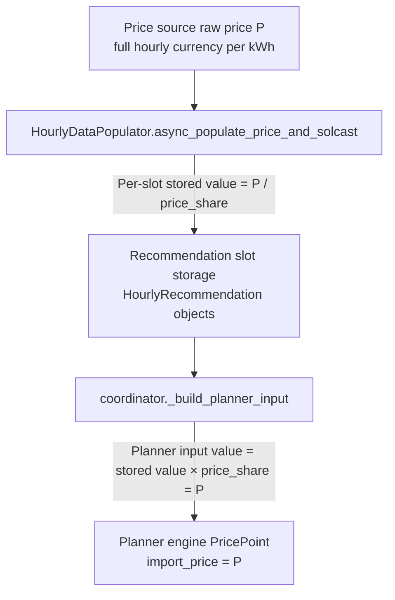

# HSEM Price Interval Semantics and Scaling

This document explains how HSEM handles the interaction between electricity price
update intervals and planning slot widths.

---

## The problem

HSEM supports two independent interval settings:

| Setting | Values | What it controls |
|---|---|---|
| `electricity_price_update_interval` | 15, 30, or 60 minutes | How often the price source publishes records |
| `recommendation_interval_minutes` | 15 or 60 minutes | The width of each planning slot |

When these differ (most commonly: price update 60 min, slots 15 min), the price rate must
be correctly scaled so the planner always sees the full currency/kWh rate.

---

## The `price_share` conversion factor

$$
\mathrm{price\_share} = \frac{\text{Price update interval}}{\text{Slot width}}
$$

| Price update interval | Slot width | `price_share` | Effect |
|---|---|---|---|
| 60 min | 15 min | 4.0 | Price ÷ 4 stored; planner gets price × 4 back |
| 15 min | 15 min | 1.0 | No scaling |
| 30 min | 15 min | 2.0 | Price ÷ 2 stored; planner gets price × 2 back |
| 60 min | 60 min | 1.0 | No scaling |

---

## Scaling pipeline

### What this is NOT

- `price_share` is **not** a VAT multiplier
- `price_share` is **not** a currency conversion
- `price_share` is **not** an energy-splitting factor (prices are rates, not energy)

---

## Price sources

HSEM is provider-agnostic. Prices are read from generic electricity price sensors:

| Config key | Purpose |
|---|---|
| `hsem_import_electricity_price_sensor` | Live import price (required) |
| `hsem_export_electricity_price_sensor` | Live export price (required) |
| `hsem_import_electricity_price_forecast_sensor` | Optional dedicated import forecast (e.g. Amber Electric) |
| `hsem_export_electricity_price_forecast_sensor` | Optional dedicated export forecast |
| `hsem_import_electricity_price_entsoe_sensor` | Optional ENTSO-E published-price import backup |
| `hsem_export_electricity_price_entsoe_sensor` | Optional ENTSO-E published-price export backup |

Supported providers include Energi Data Service, Nord Pool, Amber Electric, and any
sensor that publishes hourly or sub-hourly price records through supported
timestamped attributes. Primary sensors commonly expose `raw_today` /
`raw_tomorrow`; ENTSO-E average-price sensors expose `prices`,
`prices_today`, and `prices_tomorrow`. The populator reads the time series
and projects it onto the planning horizon.

The ENTSO-E fields are an optional pair. Nord Pool or another configured
primary source keeps priority for every valid published price; ENTSO-E is a
published-price backup, not a prediction source. HSEM validates that both
backup channels exist, have aligned timezone-aware finite records, use the
configured cadence, and report the same non-empty units as their corresponding
primary channels.

## Final-price basis

Every configured sensor must already report the final price rate HSEM should
optimize, in the same currency/kWh basis. HSEM deliberately performs no
currency conversion and adds no VAT, tariff, markup, or grid fee. This keeps
source-specific billing rules outside the planner and prevents the primary and
backup paths from applying different transformations.

For the HACS `JaccoR/hass-entso-e` integration, configure separate import and
export entries when their adjustments differ, then select each entry's
**Average electricity price** entity. In v0.7.5, the currency option labels the
unit but does not convert the ENTSO-E EUR price, the VAT value is a fraction
(`0.25` means 25%, not `25`), and VAT is applied after the price modifier.
Perform currency conversion and tariff adjustments in that integration's
sensor configuration, then compare overlapping primary and ENTSO-E points in
Developer Tools before enabling the backup. A matching unit proves only the
declared basis, not that the numeric transformation is correct. See
[ENTSO-E Price Backup](entsoe-price-backup.md) for a complete configuration and
validation example.

---

## Invariants

For any configuration:

1. A 60-min price source value of `P` must reach the planner as `P` (not `P/4` or `P*4`)
2. A 15-min price source value of `P` must reach the planner as `P`
3. Intermediate per-slot stored values must equal `P / price_share`
4. Changing `electricity_price_update_interval` from 60 to 15 with the same
   price input must not change the price seen by the planner engine
5. Negative prices must survive the full pipeline unchanged (no absolute-value
   clipping, no zero-flooring)
6. A valid primary value, including zero or a negative price, must never be
   overwritten by the ENTSO-E backup
7. ENTSO-E import and export prices must be accepted as one aligned pair, never
   mixed independently

---

## Multi-day price data

For horizons beyond 24 hours, prices and PV data are projected onto the shared
time-series index per calendar day:

| Field | Source | Day offset |
|---|---|---|
| Today's prices | Live price sensor attributes | `day_offset = 0` |
| Tomorrow's prices | Tomorrow sensor attributes (or same sensor) | `day_offset = 1` |
| Day+2 prices | Day+2 sensor attributes (if available) | `day_offset = 2` |

Missing future-day data is surfaced in `DataQuality` as:
- `tomorrow_price_missing_hours`
- `day2_price_missing_hours`
- `tomorrow_pv_missing_hours`
- `day2_pv_missing_hours`

Non-critical missing data triggers `Degraded` mode (writes allowed).
