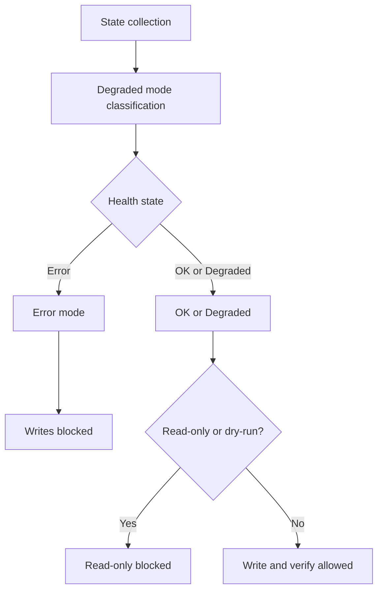

# HSEM Safety Modes and Hardware Write Protection

This document describes the layered safety system that protects the Huawei Solar
hardware from unsafe or incomplete planner inputs.

---

## Safety layers

HSEM has four independent safety mechanisms:

```
Layer 1: Degraded Mode Classification  (utils/degraded_mode.py)
Layer 2: Read-Only / Dry-Run Gate       (config, switch entity)
Layer 3: Write-Verify Applier           (utils/inverter_verify.py)
Layer 4: Runtime Recommendation Resolver (custom_sensors/recommendation_resolver.py)
```

---

## Layer 1: Degraded mode classification

Every update cycle, the state collector classifies the system health into one
of three states:

| Mode | Writes allowed | Meaning |
|---|---|---|
| `OK` | ✅ Yes | All required control/telemetry entities are present and readable |
| `Degraded` | ✅ Yes (with warnings) | A non-critical live control/telemetry entity is missing |
| `Error` | ❌ Blocked | Critical data missing — hardware writes are **blocked** |

### Critical entities (trigger `Error` mode)

If any of these entity labels appear in the missing-entities list, writes are blocked:

- `batteries_state_of_capacity` — Battery SoC sensor
- `batteries_maximum_charging_power` — Max charge power setting
- `batteries_maximum_discharging_power` — Max discharge power setting
- `batteries_rated_capacity` — Battery nameplate capacity
- `house_consumption_power` — House load sensor

### Non-critical entities (trigger `Degraded` mode)

All other missing entities produce `Degraded` mode. The plan is computed and
applied, but warnings are logged and surfaced in `data_quality`.

Examples include optional EV charger states. Price/PV forecast gaps are not
added to the live missing-entity list: they are represented by explicit
per-slot availability and `data_quality` instead.

### Price-source outages

An unavailable import/export price source does not skip the planner or enter
`Error` mode. Missing numeric fields remain `0.0` for display compatibility,
but are non-actionable. At the first unavailable slot the economic horizon
closes and automatic primary storage is held (TOU, zero discharge cap, no
charge/discharge); controlled secondary storage uses Utility. A current-slot
outage publishes that Hold directly even if another input prevents a solve.
Explicit user force mode remains higher authority. The inverter export-control
path makes no new price-driven write and retains its last verified limit.

### Classification logic

```python
def classify_degraded_mode(missing_entities, missing_entities_list):
    if not missing_entities:
        return DegradedMode.OK
    for label in missing_entities_list:
        if any(kw in label.lower() for kw in _CRITICAL_KEYWORDS):
            return DegradedMode.Error
    return DegradedMode.Degraded
```

---

## Layer 2: Read-Only / Dry-Run gates

Two independent mechanisms block all hardware writes:

### Read-only mode

- Set via the `switch.hsem_read_only` entity
- When `on`, the applier bypasses all hardware writes
- Useful for: monitoring the planner without taking control of the inverter
- Configurable in the options flow or via the switch entity

### Dry-run mode

- Set programmatically via `PlannerInput.is_read_only`
- Same effect as read-only — blocks writes
- Used internally during testing and diagnostics

---

## Layer 3: Write-Verify Applier

The `WriteVerifyApplier` (`utils/inverter_verify.py`) wraps every hardware write
with a read-back verification loop:

```
1. Check: is_read_only?     → skip if True
2. Check: degraded mode?    → skip if Error
3. Check: inverter unloading? → skip if True
4. Write the desired value via Huawei Solar service call
5. Wait settle time (default 10 s) for inverter to persist
6. Read back the entity state
7. Compare: value matches?  → OK
   - Yes: return ApplyResult.OK
   - No:  retry up to max_retries
8. If all retries exhausted → return ApplyResult.FAILED
```

### Apply status values

| Status | Meaning |
|---|---|
| `ok` | Read-back value matched desired value within tolerance |
| `unverified` | Write accepted but read-back timed out or returned `None` |
| `failed` | All retries exhausted — inverter did not accept the value |
| `skipped` | Current value already matched — no write performed |

### Verified writes

The applier verifies these hardware writes:

1. **Battery working mode** — `select.batteries_working_mode` set to the
   appropriate TOU mode for the current recommendation
2. **Grid export power** — `set_maximum_feed_grid_power_percent` adjusted
   to zero when export should be blocked, or restored to 100 % when allowed
3. **TOU periods** — `set_tou_periods` applied from the current dynamically
   planned recommendation

---

## Layer 4: Runtime recommendation resolver

Applied to the **current slot only** at hardware-write time. Overrides the
planner output with live sensor readings:

| Priority | Condition | Action |
|---|---|---|
| 1 (highest) | Current slot actionable and available live import price < 0 | → `force_export` (overrides lower priorities) |
| 2 | Current recommendation = `batteries_charge_grid` | Kept (never overridden) |
| 3 | Any EV actively charging | → `ev_smart_charging` |
| — | None of the above | Accepted planner recommendation kept |

### Protection rules

- `batteries_charge_grid` is **never** overridden by the runtime resolver
- `force_export` from a published, actionable negative price always beats EV charging
- The resolver reads live sensor data that was unavailable at planning time
  (actual inverter working mode, real-time EV charge state)
- A `primary_battery_hold` survives an `ev_smart_charging` display relabel;
  EV V2H force-max cannot turn an unknown-price Hold into discharge

---

## Safety gate interactions


